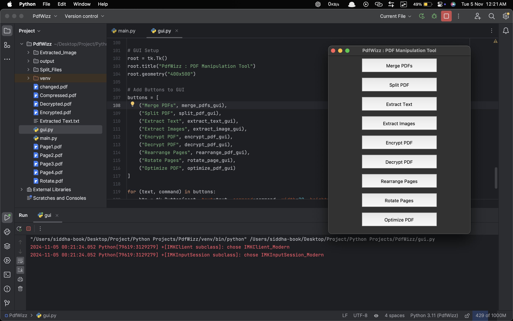

## PdfWizz
A PDF Manipulation Tool that is comprehensively built using python to handle a wide range of PDF tasks efficiently such as to merge multiple PDFs, split pages, extract content, or enhance file security.

This PDF Manipulation Tool is a Python-based utility designed to perform a wide range of operations on PDF files. With functionalities including merging, splitting, text and image extraction, encryption, decryption, page rearrangement, rotation, and compression, it covers many essential PDF tasks. This tool leverages the power of PyPDF2, pdfplumber, and PyMuPDF libraries to provide seamless PDF processing.

## Features

	•	Merge PDFs: Combine multiple PDF files into a single document.
	•	Split PDF: Separate a PDF into individual pages, each saved as its own file.
	•	Extract Text: Retrieve text from a PDF and save it to a .txt file.
	•	Extract Images: Extract images from each page of a PDF and save them as separate image files.
	•	Encrypt PDF: Add password protection to secure a PDF file.
	•	Decrypt PDF: Remove password protection from a secured PDF.
	•	Rearrange Pages: Change the order of pages within a PDF.
	•	Rotate Pages: Rotate pages to a specified orientation (e.g., 90, 180, 270 degrees).
	•	Compress PDF: Optimize and reduce the size of a PDF file.

 ## Screenshot:
   

## Prerequisites
```
pip install PyPDF2 pdfplumber pymupdf
```

## Notes

	•	Page Rotation: Rotation angles can be set to 90, 180, or 270 degrees.
	•	Encryption/Decryption: Ensure the correct password is provided when encrypting or decrypting PDF files.
	•	Compression: File size may be reduced by compression, though some image quality loss might occur.
